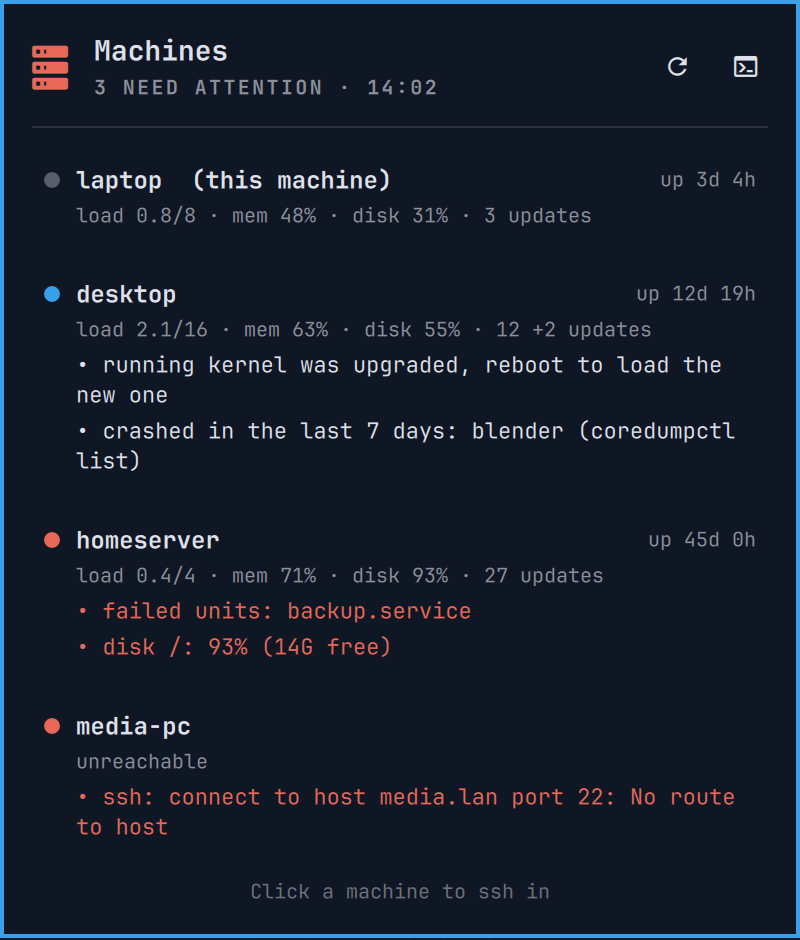

<h1 align="center">Machines</h1>

<p align="center">See at a glance which of your machines needs attention: load, memory, disk, pending updates, failed units and crashes, checked locally and over ssh.</p>

<p align="center"><a href="https://github.com/tcballard/omarchy-badges"></a></p>

<p align="center"></p>

A bar icon that shows a count when a machine needs attention and turns urgent
when one is in trouble or unreachable. It stays dim until you add machines
besides the one you are on. It comes with a `machines` command that prints the same check as
a table in the terminal.

- **Left-click:** a popup with one row per machine and the issues behind its
  status. Click a machine to open an ssh session to it.
- **Middle-click** (or <kbd>r</kbd> in the popup): check now.
- **Right-click:** the full table in a floating terminal.

The bottom of the popup opens your list of machines and the settings in your
editor, can hand the setup to your coding agent, and uninstalls the plugin.

## What it checks

| Column | Warns when |
| --- | --- |
| Uptime, load, memory | load is at or above the CPU count, memory is 90% used |
| Disk `/` | 80% full (90% is shown as a problem) |
| Updates | 50 or more pending, or the running kernel was upgraded and needs a reboot (pacman with `checkupdates`, `yay` for AUR, or apt) |
| Failed units | any failed systemd unit, system or user |
| Crashes | any core dump in the last 7 days (`coredumpctl`). Once you have looked into them, dismiss them with the ✓ on their line in the popup; only crashes after that show. |
| Agent, git repositories | optional, see [settings](#optional-settings) |

A machine that cannot be reached within a few seconds shows as down with the
ssh error.

## Requirements

- Omarchy 4.
- Python 3, which comes with Omarchy.
- Starship, only for the machine's name in the prompt in
  [Know where you are](#know-where-you-are). Starship is Omarchy's default
  prompt; if you have switched to another one, show the hostname over ssh
  in that prompt instead.
- The machines you list: Linux with `bash`, reachable with `ssh <target>` using
  a key, without any password prompt. The check never prompts, so a machine
  that asks for a password shows as unreachable.

## Install

```bash
omarchy plugin add https://github.com/Frestina/omarchy-machines --enable
```

On its first run the widget creates `~/.config/omarchy-machines/` with two
files, and never replaces them once they exist:

- `hosts`: your machines, starting with the one you are on.
- `config`: the [optional settings](#optional-settings), all switched off.

Add your other machines with **Machines** at the bottom of the popup, which
opens the list in your editor. Each line is `<label> <ssh target>
[<hostname>]`. The target is whatever you would type after `ssh`. The line
whose hostname matches the machine you are on, or whose target is `local`, is
checked locally without ssh, so you can copy the same file to every machine.
The widget checks again whenever you save.

### Or let your agent do it

**Set up with agent** starts your default coding agent (`omarchy agent`; pick
one in the Omarchy menu if you haven't) with [a setup guide](docs/AGENT_SETUP.md).
It reads your `~/.ssh/config`, suggests machines, tests them with your
permission and fills in both files with you. Omarchy starts agents with their
approval prompts switched off, so the guide limits the agent to writing those
two files and asks before it connects anywhere.

### The `machines` command

The same check as a table in your terminal comes with the plugin, but isn't
on your `PATH` until you link it (**Set up with agent** offers to do this):

```bash
ln -s ~/.config/omarchy/plugins/io.github.frestina.machines/bin/machines ~/.local/bin/machines
```

## Optional settings

Open them with **Settings** at the bottom of the popup, and remove the `#` in
front of a setting to turn it on. They are kept in
`~/.config/omarchy-machines/config`, as in [examples/config](examples/config).

| Setting | Effect |
| --- | --- |
| `ssh_options` | Extra options for the polling ssh connections, for example `-o IdentityAgent=none` to keep a password manager's agent from asking for approval on every check. |
| `agent_socket` | Adds an AGENT column: whether this agent is running and unlocked on this machine. |
| `forwarded_agent_socket` | On the other machines: whether an ssh session has forwarded your agent there right now. |
| `repo` | Adds a column, named after the folder, comparing a git repository across machines: uncommitted and unpushed changes, and commits behind or ahead of its upstream. One line per repository. Every machine with a repository at that path reports it, and the others show `-`, so a project that lives only on a machine you ssh into works too. The popup lists each repository under every machine that has it: muted when up to date, in full when it is out of sync. It never counts as needing attention. `dotfiles = <path>` from earlier versions still works the same way. |

The refresh interval (10 minutes by default) is a widget setting in the bar
settings.

## Know where you are

The popup opens ssh sessions in a terminal with the window class
`org.omarchy.ssh`. Two small additions make those sessions easy to tell apart
from local ones. **Set up with agent** offers to make both for you, or add them
yourself:

Give them their own border. Add this at the end of
`~/.config/hypr/hyprland.lua`:

```lua
-- >>> omarchy-machines: ssh sessions from the Machines bar widget get a border
-- colour from the current theme. `machines --uninstall` removes this block.
pcall(dofile, os.getenv("HOME") .. "/.config/omarchy/plugins/io.github.frestina.machines/hypr/ssh-border.lua")
-- <<< omarchy-machines
```

The plugin's [hypr/ssh-border.lua](hypr/ssh-border.lua) picks the colour
from your theme. Of the theme's colours it takes the one that looks most
different from the theme's own window border, and is still clear on its
background. It never picks red, so the border can't be mistaken for an
error. Omarchy reloads Hyprland when you switch themes, so the border
follows the new theme. Once the plugin is removed, the line does nothing.

Show the machine's name in the prompt over ssh with starship, on each machine
you connect to. In its `~/.config/starship.toml`, add `$hostname` at the start
of `format` (Omarchy's default `format` leaves it out), then:

```toml
[hostname]
ssh_only = true
style = "bold yellow"
```

A colour name like `yellow` follows your theme too: the prompt is drawn by
your own terminal, which Omarchy recolours with the theme. It can't follow
the border's pick, because it is set on the machine you connect to. So in
themes where the border takes another colour, the two differ.

## What it runs and stores

- The widget runs the bundled `bin/machines` on start, every refresh interval
  and when you ask for a check.
- That runs a read-only shell script on each machine: locally with `bash`, on
  the others with `ssh -T -o BatchMode=yes -o ConnectTimeout=4 -o
  ForwardAgent=no`. It reads system state and changes nothing.
- It creates `~/.config/omarchy-machines/hosts` and `config` if they are
  missing, and edits nothing after that.
- The last result is cached in `~/.cache/omarchy-machines/`.
- Crashes you dismiss are remembered in
  `~/.local/state/omarchy-machines/dismissed-crashes.json`, on the machine you
  dismissed them from.
- **Uninstall** removes only what is listed under [Remove](#remove), after
  asking.
- Your machine list and settings stay in `~/.config/omarchy-machines/` on your
  machine; nothing is sent anywhere else.
- **Set up with agent** runs `omarchy agent` with your default coding agent,
  which sends what it reads to that agent's provider like any other session.

## Update

```bash
omarchy plugin update io.github.frestina.machines
omarchy restart shell
```

The restart makes the shell load the new widget code; the `machines` command
updates without it.

## Remove

Choose **Uninstall** at the bottom of the popup, or run:

```bash
~/.config/omarchy/plugins/io.github.frestina.machines/bin/machines --uninstall
```

It lists what the plugin and its setup left on this machine, and asks whether
to remove all of it or only the plugin:

- `~/.config/omarchy-machines`, `~/.cache/omarchy-machines` and
  `~/.local/state/omarchy-machines`
- the `~/.local/bin/machines` link, if it points at this plugin
- the [Know where you are](#know-where-you-are) border in
  `~/.config/hypr/hyprland.lua`. Only the block between the
  `omarchy-machines` markers is removed, or the `org.omarchy.ssh` rule that
  earlier versions added.

Then it runs `omarchy plugin remove`.

**It never touches the starship prompt.** Your `starship.toml` may hold
settings of your own in the same places, so it is up to you. The machine's
name in the prompt works without the plugin and can stay. To remove it, edit
`~/.config/starship.toml` on each machine where you added it: take `$hostname`
out of `format`, and delete the `[hostname]` table, along with
`[hostname.aliases]` if you have one. If the file had no `format` before,
starship's default shows the hostname over ssh on its own, so delete only the
`[hostname]` tables.

### Removing by hand

`omarchy plugin remove io.github.frestina.machines`, or removing the plugin
from the Omarchy menu, deletes only the plugin folder. Delete the rest
yourself:

```bash
rm -r ~/.config/omarchy-machines ~/.cache/omarchy-machines ~/.local/state/omarchy-machines
rm ~/.local/bin/machines   # if you linked the command
```

Then remove the `omarchy-machines` block (or the `org.omarchy.ssh` rule)
from `~/.config/hypr/hyprland.lua`, and the starship settings as above.

## Development

Requires Node.js 22 and Python 3. Run the checks from the repository root:

```bash
./tests/run
```

[Develop and test](docs/DEVELOPMENT.md) · [Architecture](ARCHITECTURE.md) · [Release process](docs/RELEASE.md)

## Compatibility

Tested on Omarchy 4 with Hyprland 0.56. Details in
[acceptance evidence](docs/ACCEPTANCE.json).

## Credits

Built from [Build Omarchy Plugins](https://github.com/tcballard/build-omarchy-plugins) guidance and the Omarchy template set. [Sources and assets](CREDITS.md).

## Licence

[MIT](LICENSE).
